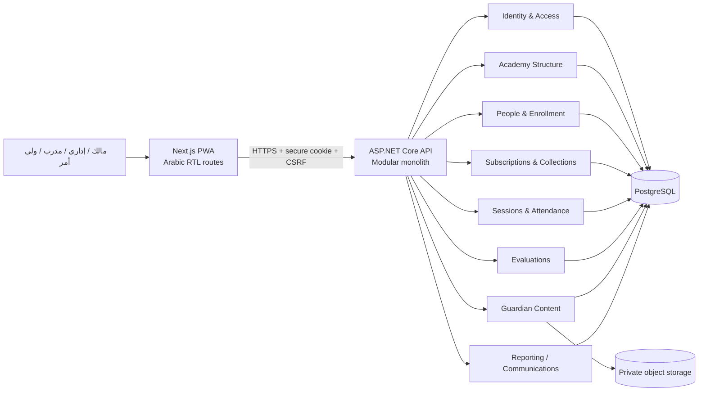

# Architecture v1.0

**الحالة: APPROVED FOR FOUNDATION IMPLEMENTATION — 2026-09-28**
**النطاق:** مرشح تنفيذي، لا يثبت بناء التطبيق أو اعتماد القرارات المفتوحة.

## الاتجاه والـ stack

Structured modular monolith بعملية API واحدة، واجهة ويب واحدة، وقاعدة PostgreSQL واحدة ذات schema مشترك وبيانات مقيدة بالأكاديمية. لا توجد customer forks أو خدمات موزعة. التوصية للديمو الأول PWA قابلة للتثبيت؛ لا تعني إنجاز تطبيق متجر native.

| الجزء | التوصية | تحقق الدعم في 2026-09-28 |
|---|---|---|
| Backend | ASP.NET Core Web API على .NET 10 LTS | Active حتى 2028-11-14؛ آخر patch عند التثبيت: https://dotnet.microsoft.com/en-us/platform/support/policy |
| Data | EF Core 10 + Npgsql EF provider 10 | EF10 LTS حتى 2028-11-10 وNpgsql 10 يدعم EF10: https://learn.microsoft.com/en-us/ef/core/what-is-new/ef-core-10.0/whatsnew وhttps://www.npgsql.org/efcore/release-notes/10.0.html |
| Database | PostgreSQL 17، آخر minor | مدعوم حتى 2029-11-08: https://www.postgresql.org/support/versioning/ |
| Frontend | Next.js 16 / React / TypeScript، App Router، PWA | 16.x Active LTS: https://nextjs.org/support-policy |
| Runtime | Node.js 24 LTS، آخر patch | LTS رسمي: https://nodejs.org/en/about/previous-releases |

لا preview dependencies. تُعاد مطابقة الإصدارات قبل أول تثبيت وتثبت lockfiles في Git.

## الشكل العام



## حدود الموديولات

- **Identity & Access:** users, roles, academy memberships, sessions, invitations/recovery، authorization policies. لا يملك روابط الوصاية نفسها.
- **Academy Structure:** Academy branding، branches، sports، age categories، groups، recurring schedules، staff assignments.
- **People & Enrollment:** Guardian وPlayer وGuardianPlayerLink وSportEnrollment؛ يعتمد على Structure ويصدر معرفات فقط للموديولات الأخرى.
- **Subscriptions & Collections:** plans، periods، renewal requests، adjustments، collections، receipts. يملك المعاملات المالية ولا تستدعيه Nutrition.
- **Sessions & Attendance:** يولّد TrainingSession مؤرخة من الجدول ويملك Attendance؛ يطلب من Subscriptions تطبيق أثر الحصة ضمن transaction.
- **Evaluations:** criteria، evaluations، scores، publish، report projections؛ يعتمد على enrollment/coach assignment.
- **Guardian Content:** sport products، nutrition information، medical records، gallery. المجالات الثلاثة نماذج وصلاحيات منفصلة.
- **Reporting / Communications:** read models وتصدير من سجلات الموديولات؛ bot/messages/ranking محفوظة ولا تبدأ قبل قرار slice.

الاتصال داخل العملية بعقود application services وأحداث in-process بعد نجاح المعاملة. لا وصول مباشر عشوائي لجداول موديول آخر. outbox يضاف فقط عند side effect خارجي موثوق مثل SMS/payment/message؛ لا broker افتراضي.

## هيكل مقترح

```text
apps/api/src/Academy.Api
apps/api/src/Academy.Modules/{Identity,Structure,People,Subscriptions,Attendance,Evaluations,Content,Reporting}
apps/api/src/Academy.Infrastructure
apps/web/src/{app,features,components,lib,locales}
tests/{unit,integration,architecture,e2e}
infra/local/compose.yaml
docs/{requirements,architecture,delivery}
```

الموديولات مشاريع/مجلدات منطقية داخل deployment واحد؛ لا مشروع أربع طبقات لكل شاشة.

## API والـ validation والأخطاء

REST تحت `/api/v1`، JSON وUTC timestamps بصيغة ISO-8601، pagination cursor أو page/size بحد أقصى، وفرز/فلاتر allowlisted. الأوامر المالية تقبل `Idempotency-Key`. التحقق البنيوي عند boundary وقواعد المجال داخل aggregate/application service. الأخطاء `application/problem+json` مع `type`, `titleAr`, `status`, `code`, `traceId`, وfield errors؛ لا stack traces أو أسرار. `400` إدخال، `401` غير مسجل، `403` ممنوع، `404` للمورد غير المرئي، `409` تعارض/تكرار، `422` قاعدة مجال. OpenAPI عقد قابل للاختبار؛ النص العربي للمستخدم في الواجهة، والأكواد ثابتة للبرمجة.

## الهوية والجلسة والصلاحية

ASP.NET Core Identity بحساب فردي، cookie آمنة لا JWT محلية عشوائية. تُنشر الواجهة و`/api` تحت الموقع نفسه عبر reverse proxy ولا يفتح CORS عامًا. يسجل المستخدم عبر endpoint same-site؛ بعد نجاح كلمة المرور/التفعيل ينشئ الخادم session record ويضع browser cookie opaque محمية: `HttpOnly`, `Secure`, `SameSite=Lax`، ويطلب anti-forgery token للكتابات. صلاحية مقترحة: idle 30 دقيقة، absolute 12 ساعة؛ خيار remember-me لا يفعّل قبل الموافقة. يتحقق الخادم من session/security stamp دوريًا، وتعطيل الحساب أو تغيير كلمة المرور أو "الخروج من كل الأجهزة" يلغي الجلسات. logout يبطل السجل ويمسح cookie.

Staff: نفّذ Slice 1 provisioning مباشرًا محدودًا من Owner/Admin بكلمة مرور مؤقتة تمر بسياسة Identity؛ لا توجد invitation delivery في هذه الشريحة. إذا استُبدل لاحقًا بدعوة فتكون single-use منتهية ومخزنة hash ويضبط الموظف كلمة مروره ثم تنتهي الدعوة. Guardian: لا ينشأ وصول من إدخال هاتف. تنشأ `GuardianPlayerLink` فقط في People/Player slice، ثم تفعيل الرقم عبر OTP من مزود معتمد؛ الاستعادة بنفس قناة التحقق مع rate limiting. لا SMS حقيقي قبل اختيار المزود. بيئة demo وحدها تستخدم حسابات/رموزًا معلنة ثابتة ومعزولة ولا تعمل بإعداد production. حساب اللاعب غير مفعّل افتراضيًا.

بعد authentication يحل الخادم AcademyMembership من الجلسة/host الموثوق ويتحقق من نشاطها؛ لا يثق في `AcademyId` من body/query/header. policy handlers تجمع role + academy membership + resource relation: المدرب ضمن StaffGroupAssignment، الولي عبر GuardianPlayerLink، الإداري ضمن فرعه، والسجل الطبي/الوسائط يحتاج permission صريحًا وحالة نشر.

## عزل الأكاديميات

الاختيار الأول: shared database/shared schema لمنتج صغير. كل root tenant entity تحمل `AcademyId`; العلاقات تستخدم composite foreign keys تشمل `AcademyId` لمنع cross-tenant references، والفهارس الفريدة تبدأ به. repository/query services تتطلب `TenantContext` server-resolved، وتطبق EF query filters للقراءات وSaveChanges interceptor يرفض null/mismatch للكتابات. raw SQL، exports، metrics، jobs، cache keys، idempotency keys ومسارات media كلها تبدأ بنطاق الأكاديمية. اختبارات integration تحاول تبديل IDs والروابط والتصدير.

لا نعتمد PostgreSQL RLS في أول slice حتى لا نوهم بحماية غير مكتملة. إذا أضيف كدفاع ثانٍ، يوضع tenant id بـ`SET LOCAL` داخل transaction لكل request/job؛ لا `SET` session دائمًا مع connection pooling، ويختبر تسرب الاتصال بعد إعادته للـ pool. background job يحمل AcademyId موثوقًا في payload ويتحقق من وجود الأكاديمية قبل التنفيذ.

## البيانات والوسائط والمعاملات

صور الأطفال والمرفقات في private object storage بمفتاح opaque مثل `academy/{id}/...` وmetadata tenant-scoped في DB. لا public bucket؛ download endpoint يفحص المورد ثم يصدر signed URL قصيرًا، مع type/size allowlist وmalware scan gate قبل production. الصور العامة/branding تفصل بسياسة أخرى.

تأكيد enrollment/renewal والتحصيل والفترة والإيصال يتم في database transaction واحدة وبـ unique idempotency record scoped إلى academy+actor+operation. `RenewalRequest` pending لا يساوي `Collection`. تجديد الغير يستعمل reference opaque، scoped، single-use، expiring، ويكشف تأكيدًا أدنى؛ السداد لا ينشئ GuardianPlayerLink. أي gateway مستقبلي يحتاج webhook signature، deduplication وoutbox؛ لا gateway مختلق الآن.

## التشغيل

- **Local:** Docker Compose صغير لـ`postgres`, `api`, `web`؛ media adapter إلى مجلد local مستبعد من Git، وprofile اختياري لمحاكي object storage. migrations تطبق بأمر صريح لا عند كل startup.
- **Demo:** config وdatabase منفصلان، clock/reference date صريح، seed idempotent بمعرفات معروفة وأكاديميتين. reset يتطلب `Environment=Demo` وdatabase marker ويقتصر على records موسومة.
- **Production:** reverse proxy/load balancer مع HTTPS، API/Web containers، managed/durable PostgreSQL، private object storage، secret manager، shared Data Protection/session storage، structured logs/metrics/traces، health/readiness، alerts، automated backups وpoint-in-time recovery حيث متاح. بوابة الإطلاق تتطلب restore drill، tenant/security tests، rotation، retention، دعم ومسؤول حوادث؛ demo-ready ليست production-ready.

## مبادئ محتفظ بها / تعقيد غير موروث

نحتفظ بالبساطة، فصل المسؤوليات، least privilege، atomic transactions، observability، واختبارات العزل. لا نزعم فحص أي مستودع قديم ولا نورث topology منه. لا microservices، Kubernetes، broker، Redis، event sourcing/CQRS framework، generic workflow engine أو control plane افتراضيًا؛ يضاف أي منها فقط بدليل حاجة وقرار مستقل.
