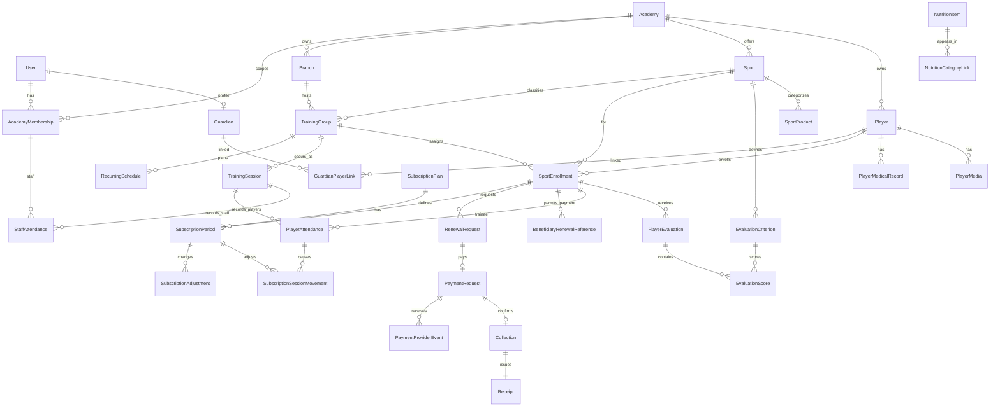
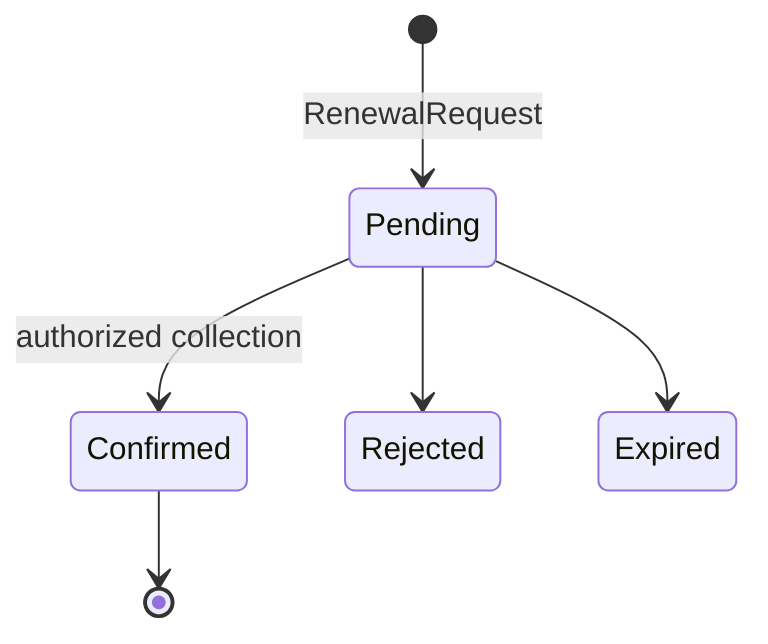
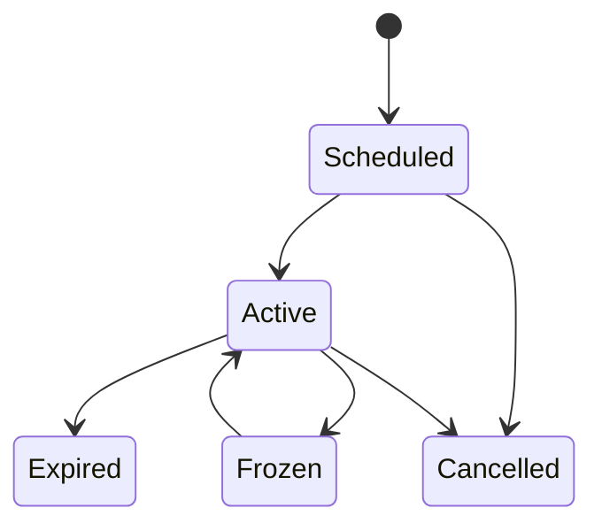

# Domain Model v1.0

**الحالة: PROPOSED — مفاهيمي، مع تحقق foundation المحدود أدناه.**

**ملاحظة تنفيذ Slice 5:** تحققت كيانات Slice 0–4، وأضيفت فعليًا `EvaluationCriterion`, `PlayerEvaluation`, و`EvaluationScore`. العلاقات المركبة تحمل `AcademyId` وتثبت تطابق evaluation/enrollment/group/sport/criterion داخل الأكاديمية. وحدات المحتوى ما زالت مستقبلية.

## العلاقات الأساسية

كل كيان tenant-owned يحمل `AcademyId` ضمن المفتاح المنطقي والعلاقات. المعرفات UUID/UUIDv7 opaque؛ الأكواد القابلة للعرض منفصلة ولا تُستخدم وحدها كصلاحية.

## الملكية والثوابت

- `Player` هوية الطفل داخل الأكاديمية؛ `SportEnrollment` هو ارتباطه برياضة/فرع/مجموعة. uniqueness يمنع تسجيلين active متطابقين وفق قاعدة تعتمد لاحقًا، ولا يمنع رياضتين. `GuardianPlayerLink` علاقة صريحة بحالة وصلاحيات، وليست استنتاجًا من الهاتف أو الدفع.
- `TrainingGroup` يجمع الرياضة/الفرع/الفئة؛ `RecurringSchedule` قالب أسبوعي، و`TrainingSession` واقعة مؤرخة بحالة `Scheduled|Held|Cancelled` ومصدر `RecurringSchedule|Manual`. FK مركب يثبت تطابق branch/sport مع المجموعة، وoccurrence فريد على academy+group+date+start.
- `PlayerAttendance` فريد على academy+session+SportEnrollment، و`StaffAttendance` منفصل ولا يقبل إلا عضوًا مكلفًا بالمجموعة. كلاهما `NotRecorded|Present|Absent`؛ عدم السجل لا يعني غيابًا.
- `SubscriptionSessionMovement` append-only لـ`AttendanceConsume(-1)` و`AttendanceRestore(+1)`، مرتبط بحضور وفترة محددين. `ConsumedSubscriptionPeriodId` يمثل الأثر الفعال، و`ReversesMovementId` الفريد يمنع استعادة الخصم مرتين. DB تمنع `RemainingSessions < 0`.
- `SubscriptionPlan` نوعه `Duration|Sessions|Combined` ويحمل العملة/السعر والمدة أو الحصص المنطبقة. `SubscriptionPeriod` تاريخ محفوظ لا يُستبدل بالتجديد. `RenewalRequest` يحتفظ بالمُسدِّد في `RequestedByUserId` والمستفيد في `SportEnrollmentId`، وهو منفصل عن `Collection`; `Receipt` يعكس Collection مؤكدة فقط. `BeneficiaryRenewalReference` يرتبط بتسجيل واحد وأكاديمية واحدة، يخزن hash وتلميحًا فقط مع expiry/revocation، ولا يمثل تفويضًا لملف اللاعب. `SubscriptionAdjustment` append-only للتجميد/الأيام/الإلغاء/التصحيح مع السبب والمنفذ.
- `EvaluationCriterion` tenant-scoped وsport-scoped، له اسم وترتيب ووزن موجب ومحور كرة قدم اختياري. الإيقاف يمنعه من تقييم جديد ولا يحذف الدرجات القديمة. `PlayerEvaluation` مرتبط بـ`SportEnrollment` ونفس الرياضة والمجموعة بعلاقات مركبة، وبالمقيّم والتاريخ والفترة؛ حالته `Draft|Published|Superseded`. `EvaluationScore` فريد على evaluation+criterion، ودرجته nullable أو 0–100 شاملًا.
- عند إنشاء المسودة تُنسخ `CriterionNameSnapshot`, `WeightSnapshot`, و`FootballAxisSnapshot` إلى `EvaluationScore`. الحساب والتقرير المنشور يستخدمان snapshots، لذلك تعديل المعيار لاحقًا لا يعيد كتابة التاريخ. التقييم المنشور immutable في Slice 5؛ التصحيح عبر revision/supersede محفوظ في النموذج لكنه مؤجل بدل السماح بالكتابة فوق المنشور.
- `SportProduct` تجارة رياضية محتملة مستقلة. `NutritionItem` معلومات وصورة وحصة وقيم/source status وتصنيفات Breakfast/Lunch/Dinner؛ لا Money أو Rating أو Cart أو Order. `PlayerMedicalRecord` و`PlayerMedia` لهما visibility/publication policy منفصلة.

## دورات الحالة

وفق `OD-004/005` المعتمدين: `Duration` يتطلب أيامًا فقط، و`Sessions` حصصًا فقط، و`Combined` الاثنين. البداية والنهاية شموليتان؛ النهاية = البداية + الأيام - 1. التجديد المبكر يلي آخر نهاية، والمنتهي يبدأ من تاريخ التأكيد. الانتقال المالي الموثق `Pending -> Confirmed` وحده ينشئ `Collection/Receipt/SubscriptionPeriod` في transaction واحدة. unique constraints على provider event وPayment→Collection وCollection→Receipt/Period، مع idempotency key لطلب التجديد، تمنع الأثر المكرر. الفشل/الإلغاء لا ينشئ أثرًا ماليًا أو اشتراكًا.

حالات `PaymentRequest`: الإنشاء الداخلي ينتج `Pending`، ومنها فقط يسمح `Confirmed|Failed|Cancelled|Expired`. كل الحالات الأربع نهائية لذلك الطلب. إعادة المحاولة بعد فشل/إلغاء/انتهاء تنشئ طلب تجديد ودفع جديدين؛ callback نجاح متأخر للطلب القديم يُحفظ كحدث متجاهل ولا ينشئ تحصيلًا أو إيصالًا أو فترة.

## دورة الحضور ورصيد الحصص

- يختار الخادم أقدم `SubscriptionPeriod` غير ملغاة/مجمدة، بدأت في أو قبل تاريخ الحصة وتغطيه، مع رصيد متاح لـ`Sessions/Combined` إن وجد. لا يقبل العميل period أو رصيدًا جديدًا.
- `Present` في `Duration` يسجل الحقيقة فقط؛ في `Sessions/Combined` يخصم واحدًا داخل transaction بعد PostgreSQL advisory transaction lock. الحفظ المتكرر وطلبان متزامنان لا يخصمان مرتين.
- الرصيد صفر لا يمنع حفظ `Present`، لكنه لا ينخفض ولا ينشئ دينًا/تحصيلًا ويعيد warning. `Absent/NotRecorded` لا يخصمان.
- `Present -> Absent|NotRecorded` يعيد واحدًا فقط إذا أنشأ هذا الحضور خصمًا، وحركة restoration تشير للحركة الأصلية. العودة لحاضر تنشئ دورة خصم جديدة موثقة. الحصة الملغاة تمنع الإدخال، ولا تُلغى حصة بعد حضور فعلي قبل تصحيحه.

## التقييم والتقارير

`IEvaluationReportCalculator` هو الحد الوحيد لمعادلة التقرير. default تقني قابل للعكس في Slice 5: لكل محور كرة قدم يحسب `sum(score × snapshot weight) / sum(snapshot weight)` للدرجات المتاحة فقط؛ missing لا تدخل ولا تصبح صفرًا. الإجمالي متوسط المحاور المتاحة، والتقريب إلى منزلة عشرية واحدة بـ`AwayFromZero`. يعرض `ScoredCriteria/TotalApplicableCriteria`, نسبة الاكتمال، و`AvailableAxes/6` كمعلومات لا كدرجة جودة. يظل `OD-007` **PENDING / NOT APPROVED**.

تقرير كرة القدم يعرض الاسم/الصورة/المركز/الإجمالي، المخطط السداسي (`Passing, Dribbling, Speed, Defending, Physical, Shooting`) وملخصه النصي، ثم العمر المحسوب في تاريخ التقييم والطول والوزن والقدم وكل criteria والملاحظات. missing axis يظهر «غير متاح»؛ fallback الرسم يضع النقطة في المركز للعرض فقط دون تلويث الحساب. لا pitch diagram ولا AI. السباحة والرياضات الأخرى تعرض البيانات والمعايير التفصيلية ورسالة أن الملخص الرسومي غير معرّف، بلا محاور كرة قدم مختلقة.

## الوقت والمال والقياسات

- التخزين الزمني `timestamptz` UTC؛ العرض بمنطقة الأكاديمية (demo: Africa/Cairo). تاريخ الميلاد وstart/end كـ`date` عندما لا يلزم وقت. clock حقن قابل للاختبار وDemoReferenceDate صريح.
- الأموال `decimal(18,2)` مع ISO currency (EGP للديمو)، بلا float. السعر الأصلي والخصم والصافي محفوظة، والتقارير تجمع Collections confirmed فقط.
- الطول cm والوزن kg بقيم decimal وحدود validation؛ العمر يحسب من الميلاد في تاريخ العرض ولا يخزن كحقيقة مستقلة.
- السجلات التاريخية audit fields (`CreatedAt`, `CreatedBy`, version/concurrency token) وأرشفة بدل الحذف عندما توجد مراجع مالية/حضور/تقييم.
