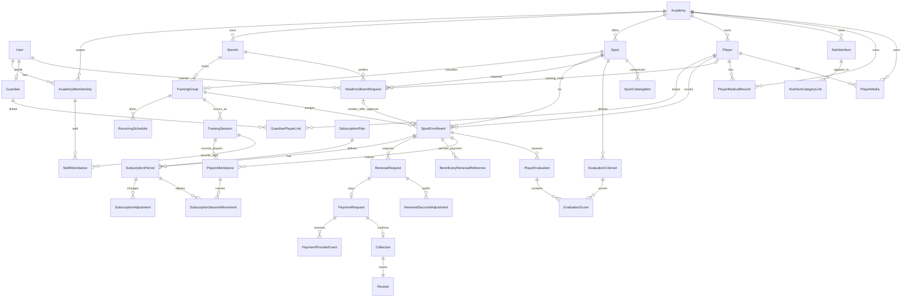
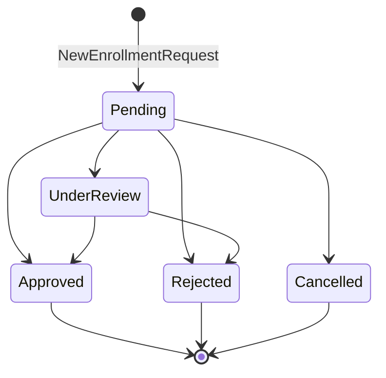
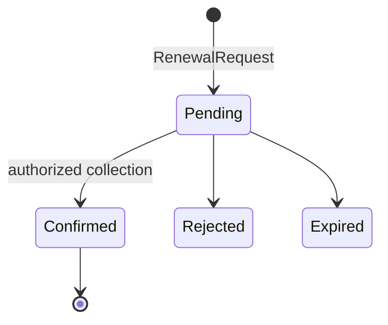
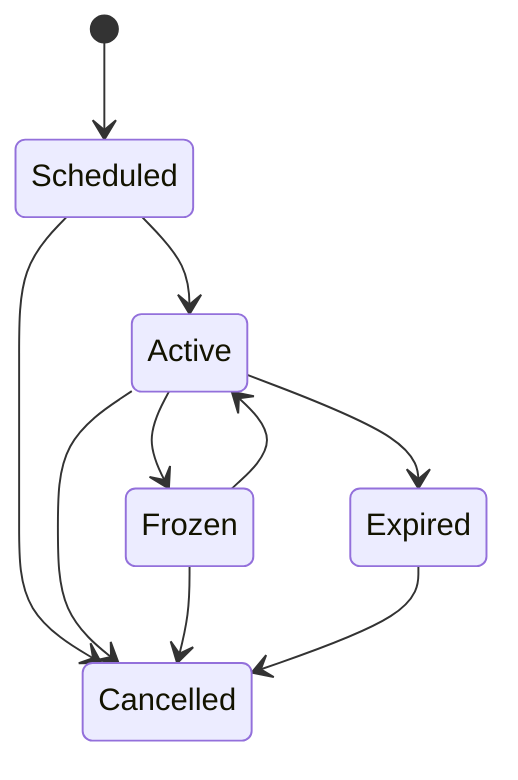

# Domain Model v1.0

**الحالة: PROPOSED — مفاهيمي، مع تحقق foundation المحدود أدناه.**

**ملاحظة تنفيذ Slice 8C:** تحققت كيانات Slice 0–8B، وأضيف snapshot السعر/الخصم/الصافي على التجديد والإيصال و`RenewalDiscountAdjustment` كسجل append-only. العلاقات المركبة تحمل `AcademyId`، ولا ينتج عن الخصم أو تعديل الفترة refund أو عكس مالي.

## العلاقات الأساسية

كل كيان tenant-owned يحمل `AcademyId` ضمن المفتاح المنطقي والعلاقات. المعرفات UUID/UUIDv7 opaque؛ الأكواد القابلة للعرض منفصلة ولا تُستخدم وحدها كصلاحية.

## الملكية والثوابت

- `Player` هوية الطفل داخل الأكاديمية؛ `SportEnrollment` هو ارتباطه برياضة/فرع/مجموعة. uniqueness يمنع تسجيلين active متطابقين وفق قاعدة تعتمد لاحقًا، ولا يمنع رياضتين. `GuardianPlayerLink` علاقة صريحة بحالة وصلاحيات، وليست استنتاجًا من الهاتف أو الدفع.
- `NewEnrollmentRequest` طلب tenant-scoped من Guardian موثق: إما `ExistingChildNewSport` مع `ExistingPlayerId` مرتبط صراحة، أو `NewChild` مع الاسم والميلاد فقط. يحمل الرياضة والفرع المفضل ولا يحمل مجموعة من ولي الأمر. حالاته `Pending|UnderReview|Approved|Rejected|Cancelled`، وله idempotency key فريد داخل academy+guardian. الطلب لا ينشئ `Player`, `GuardianPlayerLink`, `SportEnrollment`, `SubscriptionPeriod`, `PaymentRequest` أو `Collection` عند التقديم.
- الاعتماد الإداري يتحقق من Academy/Sport/Branch/TrainingGroup ومن عدم التسجيل النشط المكرر، ثم ينشئ أو يعيد استخدام Player باختيار إداري صريح، وينشئ GuardianPlayerLink صريحة وتسجيلًا واحدًا داخل transaction. الهاتف أو تطابق الاسم لا ينشئان ربطًا. الطلب المعتمد يشير إلى Player والتسجيل الناتجين؛ الرفض يحفظ السجل وسببًا منفصلًا ظاهرًا لولي الأمر دون كشف `AdminNotes`.
- `TrainingGroup` يجمع الرياضة/الفرع/الفئة؛ `RecurringSchedule` قالب أسبوعي، و`TrainingSession` واقعة مؤرخة بحالة `Scheduled|Held|Cancelled` ومصدر `RecurringSchedule|Manual`. FK مركب يثبت تطابق branch/sport مع المجموعة، وoccurrence فريد على academy+group+date+start.
- `PlayerAttendance` فريد على academy+session+SportEnrollment، و`StaffAttendance` منفصل ولا يقبل إلا عضوًا مكلفًا بالمجموعة. كلاهما `NotRecorded|Present|Absent`؛ عدم السجل لا يعني غيابًا.
- `SubscriptionSessionMovement` append-only لـ`AttendanceConsume(-1)` و`AttendanceRestore(+1)`، مرتبط بحضور وفترة محددين. `ConsumedSubscriptionPeriodId` يمثل الأثر الفعال، و`ReversesMovementId` الفريد يمنع استعادة الخصم مرتين. DB تمنع `RemainingSessions < 0`.
- `SubscriptionPlan` نوعه `Duration|Sessions|Combined` ويحمل العملة/السعر والمدة أو الحصص المنطبقة. `SubscriptionPeriod` تاريخ محفوظ لا يُستبدل بالتجديد. `RenewalRequest` يحتفظ بالمُسدِّد في `RequestedByUserId` والمستفيد في `SportEnrollmentId`، وهو منفصل عن `Collection`; `Receipt` يعكس Collection مؤكدة فقط. `BeneficiaryRenewalReference` يرتبط بتسجيل واحد وأكاديمية واحدة، يخزن hash وتلميحًا فقط مع expiry/revocation، ولا يمثل تفويضًا لملف اللاعب.
- `SubscriptionAdjustment` tenant-scoped وappend-only بأنواع `FreezeStarted|FreezeEnded|DaysAdded|DaysDeducted|Cancelled`. يحتفظ بتاريخ السريان، فرق الأيام، النهاية القديمة/الجديدة، السبب المنظف، المنفذ ووقت UTC، ويربط `FreezeEnded` ببداية التجميد المقابلة. مفتاح idempotency فريد داخل الأكاديمية+المنفذ+نوع العملية، و`xmin` يحمي من الكتابة فوق تعديل متزامن. لا توجد API لتعديل أو حذف السجل.
- `RenewalRequest` يحفظ `OriginalAmount`, نوع/قيمة الخصم، `DiscountAmount`, `FinalAmount`, العملة، السبب والمنفذ/التوقيت. القيم snapshot لا يعاد حسابها إذا تغير سعر الباقة. `RenewalDiscountAdjustment` يحفظ old/new للخصم والصافي مع السبب والمنفذ وcommand key فريد، ولا توجد API لتعديله أو حذفه.
- `EvaluationCriterion` tenant-scoped وsport-scoped، له اسم وترتيب ووزن موجب ومحور كرة قدم اختياري. الإيقاف يمنعه من تقييم جديد ولا يحذف الدرجات القديمة. `PlayerEvaluation` مرتبط بـ`SportEnrollment` ونفس الرياضة والمجموعة بعلاقات مركبة، وبالمقيّم والتاريخ والفترة؛ حالته `Draft|Published|Superseded`. `EvaluationScore` فريد على evaluation+criterion، ودرجته nullable أو 0–100 شاملًا.
- عند إنشاء المسودة تُنسخ `CriterionNameSnapshot`, `WeightSnapshot`, و`FootballAxisSnapshot` إلى `EvaluationScore`. الحساب والتقرير المنشور يستخدمان snapshots، لذلك تعديل المعيار لاحقًا لا يعيد كتابة التاريخ. التقييم المنشور immutable في Slice 5؛ التصحيح عبر revision/supersede محفوظ في النموذج لكنه مؤجل بدل السماح بالكتابة فوق المنشور.
- `SportCatalogItem` tenant/sport-scoped ويحمل الاسم والوصف ومرجع أصل مشروع وحالة وترتيبًا، مع display price/currency/discount اختيارية لا تنشئ تجارة أو معاملة مالية. الظهور لولي الأمر يتطلب item فعالًا ورياضة ذات `SportEnrollment` نشط لطفل مرتبط؛ تجميع الرياضة يمنع التكرار بين الأبناء. لا Cart/Order/Inventory/Rating/Favourite.
- `NutritionItem` tenant-scoped ومعلوماتي فقط: اسم ووصف ومرجع صورة وحصة وقيم nullable و`DemoUnreviewed|Reviewed` ومصدر وحالة. `NutritionCategoryLink` مفتاحه academy+item+category ويربط المادة نفسها بـ`Breakfast|Lunch|Dinner` دون نسخ قيمها؛ القيود تمنع السالب. لا Money أو Price أو Discount أو Rating أو Quantity أو Cart أو Order أو Checkout أو Payment أو Delivery أو Inventory، ولا علاقة بالطفل أو اشتراكه.
- `PlayerMedicalRecord` tenant/player-scoped ونوعه `Injury|Consultation` وحالته العامة `Open|Monitoring|Resolved`. يفصل `StaffNotes` عن `GuardianVisibleNotes`، ولا يظهر للGuardian إلا `IsPublishedToGuardian=true` بعد إثبات `GuardianPlayerLink`; Coach بلا صلاحية افتراضية. لا تشخيص أو توصية آلية.
- `PlayerMedia` tenant/player-scoped ويخزن metadata فقط لـ`Image|Video` مع reference/caption/time/order/publication. Guardian يرى published لطفله المرتبط فقط. Slice 7 يقبل refs تحت `/demo-assets/` بلا `..` أو URL خارجي؛ لا binary upload أو public child bucket أو production object storage.

## دورات الحالة

وفق `OD-004/005` المعتمدين: `Duration` يتطلب أيامًا فقط، و`Sessions` حصصًا فقط، و`Combined` الاثنين. البداية والنهاية شموليتان؛ النهاية = البداية + الأيام - 1. التجديد المبكر يلي آخر نهاية، والمنتهي يبدأ من تاريخ التأكيد. الانتقال المالي الموثق `Pending -> Confirmed` وحده ينشئ `Collection/Receipt/SubscriptionPeriod` في transaction واحدة. unique constraints على provider event وPayment→Collection وCollection→Receipt/Period، مع idempotency key لطلب التجديد، تمنع الأثر المكرر. الفشل/الإلغاء لا ينشئ أثرًا ماليًا أو اشتراكًا.

## خصم التجديد في Slice 8C

- `OriginalAmount` يثبت من `SubscriptionPlan.Price` وقت إنشاء التجديد. النسبة `(0,100]` تحسب وتقرّب إلى منزلتين بعيدًا عن الصفر، والمبلغ الثابت `(0, OriginalAmount]`؛ دائمًا `FinalAmount = OriginalAmount - DiscountAmount >= 0`.
- Owner/Admin فقط يرسل النوع والقيمة والسبب مع `ExpectedVersion` و`Idempotency-Key`. الخادم لا يقبل `FinalAmount`, `DiscountAmount`, مبلغ الدفع أو التحصيل من العميل. `xmin` وtransaction يحميان من lost update.
- عند تطبيق/تغيير/إزالة خصم قبل التأكيد يصبح `PaymentRequest` المعلق القديم `Cancelled` ويُنشأ بديل بالمبلغ النهائي؛ `RenewalRequest.PaymentRequestId` يشير للحالي. callback قديم أو بمبلغ لا يساوي `PaymentRequest.Amount == RenewalRequest.FinalAmount` مرفوض بلا أثر.
- التأكيد ينشئ `Collection.Amount` و`Receipt.Amount/FinalAmount` بالصافي، ويحفظ الإيصال الأصل والخصم. retry بعد الفشل ينشئ محاولة تجديد/دفع جديدة بنفس snapshot المعتمد؛ تغيير سعر الباقة أو تجميد/أيام/إلغاء الفترة لاحقًا لا يغير التاريخ المالي.

حالات `PaymentRequest`: الإنشاء الداخلي ينتج `Pending`، ومنها فقط يسمح `Confirmed|Failed|Cancelled|Expired`. كل الحالات الأربع نهائية لذلك الطلب. إعادة المحاولة بعد فشل/إلغاء/انتهاء تنشئ طلب تجديد ودفع جديدين؛ callback نجاح متأخر للطلب القديم يُحفظ كحدث متجاهل ولا ينشئ تحصيلًا أو إيصالًا أو فترة.

## تعديلات فترة الاشتراك في Slice 8B

- التجميد متاح لفترة `Active` من نوع `Duration` أو `Combined` فقط؛ يسجل `FrozenFromDate` و`FreezeStarted` ولا يغير `EndDate`. `Sessions` بلا مدة يرفض برسالة عربية واضحة. أثناء `Frozen` لا تستهلك الحضور حصة، مع بقاء حقيقة الحضور.
- الاستئناف يتطلب تاريخًا بعد بداية التجميد. عدد الأيام = الأيام المحلية من بداية التجميد شاملة حتى اليوم السابق للاستئناف؛ يمدد `EndDate` بهذا العدد، يسجل `FreezeEnded` مرتبطًا بالبداية، ولا يعيد ضبط `RemainingSessions`.
- إضافة/خصم الأيام يغير `EndDate` فقط لـ`Duration/Combined`، بحد أمان تقني 1–365 يومًا لكل أمر. الخصم لا يسمح بنهاية قبل البداية، والحالة المشتقة تصبح `Expired` إن أصبحت النهاية قبل ساعة الأعمال. لا تعيد العملية حساب حضور أو حركات تاريخية.
- الإلغاء إداري لفترة واحدة فقط، ويحفظ تاريخ السريان والسبب ويضبطها `Cancelled`. لا يلغي فترة مدفوعة لاحقة أو رياضة/شقيقًا آخر، ولا يحذف حضورًا أو حركة حصص. `Collection`, `Receipt`, مبلغ الدفع والسجل المدفوع ثابتة؛ لا refund أو proration أو payment reversal.
- كل أمر يتطلب سببًا حتى 500 حرف و`Idempotency-Key`، وينفذه Owner/Admin فقط داخل tenant الخادم. Guardian يرى الحالة والتاريخ المبسط لطفل مرتبط بلا معرف موظف أو سبب داخلي، وCoach لا يملك mutation.

## دورة الحضور ورصيد الحصص

- يختار الخادم أقدم `SubscriptionPeriod` غير ملغاة/مجمدة، بدأت في أو قبل تاريخ الحصة وتغطيه، مع رصيد متاح لـ`Sessions/Combined` إن وجد. لا يقبل العميل period أو رصيدًا جديدًا.
- `Present` في `Duration` يسجل الحقيقة فقط؛ في `Sessions/Combined` يخصم واحدًا داخل transaction بعد PostgreSQL advisory transaction lock. الحفظ المتكرر وطلبان متزامنان لا يخصمان مرتين.
- الرصيد صفر لا يمنع حفظ `Present`، لكنه لا ينخفض ولا ينشئ دينًا/تحصيلًا ويعيد warning. `Absent/NotRecorded` لا يخصمان.
- `Present -> Absent|NotRecorded` يعيد واحدًا فقط إذا أنشأ هذا الحضور خصمًا، وحركة restoration تشير للحركة الأصلية. العودة لحاضر تنشئ دورة خصم جديدة موثقة. الحصة الملغاة تمنع الإدخال، ولا تُلغى حصة بعد حضور فعلي قبل تصحيحه.

## التقييم والتقارير

`IEvaluationReportCalculator` هو الحد الوحيد لمعادلة التقرير. default تقني قابل للعكس في Slice 5: لكل محور كرة قدم يحسب `sum(score × snapshot weight) / sum(snapshot weight)` للدرجات المتاحة فقط؛ missing لا تدخل ولا تصبح صفرًا. الإجمالي متوسط المحاور المتاحة، والتقريب إلى منزلة عشرية واحدة بـ`AwayFromZero`. يعرض `ScoredCriteria/TotalApplicableCriteria`, نسبة الاكتمال، و`AvailableAxes/6` كمعلومات لا كدرجة جودة. يظل `OD-007` **PENDING / NOT APPROVED**.

تقرير كرة القدم يعرض الاسم/الصورة/المركز/الإجمالي، المخطط السداسي (`Passing, Dribbling, Speed, Defending, Physical, Shooting`) وملخصه النصي، ثم العمر المحسوب في تاريخ التقييم والطول والوزن والقدم وكل criteria والملاحظات. missing axis يظهر «غير متاح»؛ fallback الرسم يضع النقطة في المركز للعرض فقط دون تلويث الحساب. لا pitch diagram ولا AI. السباحة والرياضات الأخرى تعرض البيانات والمعايير التفصيلية ورسالة أن الملخص الرسومي غير معرّف، بلا محاور كرة قدم مختلقة.

## الوقت والمال والقياسات

- التخزين الزمني `timestamptz` UTC؛ العرض بمنطقة الأكاديمية (demo: Africa/Cairo). تاريخ الميلاد وstart/end كـ`date` عندما لا يلزم وقت. clock حقن قابل للاختبار وDemoReferenceDate صريح.
- الأموال `decimal(18,2)` مع ISO currency (EGP للديمو)، بلا float. السعر الأصلي والخصم والصافي محفوظة، والتقارير تجمع Collections confirmed فقط.

### Read models التشغيلية في Slice 8A

- `OwnerSummary`, `FinancialReportRow`, `AttendanceReportRow` و`ReceiptListRow` نماذج قراءة مشتقة وليست entities أو جداول حقيقة جديدة. المصدر المالي الوحيد هو `PaymentCollection` المؤكد، مع snapshots التاريخية من `Receipt`؛ حالات `PaymentRequest` المعلقة/الفاشلة/الملغاة/المنتهية تُعد تشغيليًا ولا تُجمع كإيراد.
- حدود التاريخ المدخلة هي أيام تقويم محلية في timezone الأكاديمية (`Africa/Cairo` للديمو)، ثم يحولها الخادم إلى نطاق UTC نصف مفتوح للتحصيلات. الحضور يستخدم `TrainingSession.SessionDate` مباشرة.
- تقرير الحضور يعرض `StoredRecordsOnly`: `Present`, `Absent`, `NotRecorded` المسجلة فقط. غياب السجل لا يتحول إلى `Absent`. سنة الميلاد مشتقة من `Player.DateOfBirth` ولا تُخزن تكراريًا، وبيانات اللاعبين والجهاز الفني تبقى منفصلة.
- الاستعلامات التفاعلية محدودة بـ366 يومًا و100 صف للصفحة، والتصدير بـ5000 صف. CSV يستخدم UTF-8 BOM ويحصّن القيم التي تبدأ بـ`=`, `+`, `-`, `@` من formula injection.
- الطول cm والوزن kg بقيم decimal وحدود validation؛ العمر يحسب من الميلاد في تاريخ العرض ولا يخزن كحقيقة مستقلة.
- السجلات التاريخية audit fields (`CreatedAt`, `CreatedBy`, version/concurrency token) وأرشفة بدل الحذف عندما توجد مراجع مالية/حضور/تقييم.
