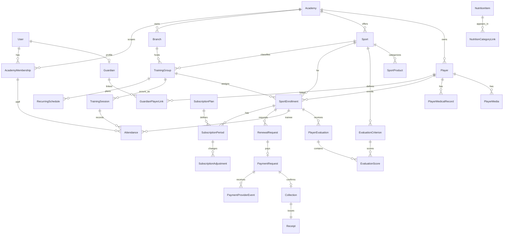
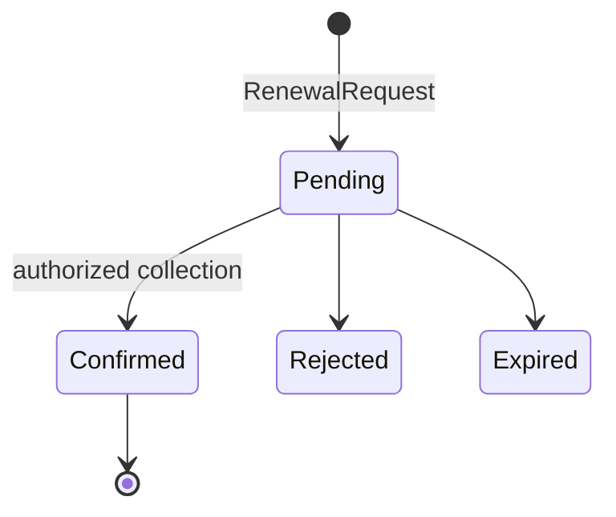
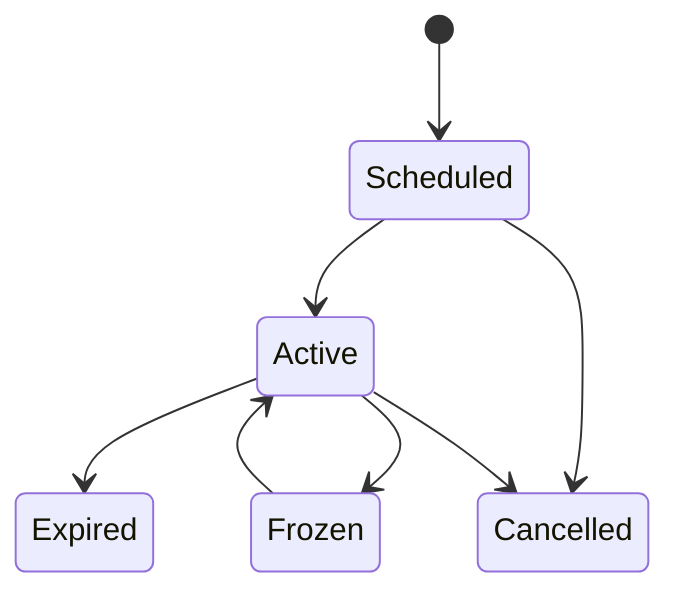

# Domain Model v1.0

**الحالة: PROPOSED — مفاهيمي، مع تحقق foundation المحدود أدناه.**

**ملاحظة تنفيذ Slice 3:** تحققت كيانات Slice 2، وأضيفت فعليًا `SubscriptionPlan`, `SubscriptionPeriod`, `RenewalRequest`, `PaymentRequest`, `PaymentProviderEvent`, `Collection`, و`Receipt`. العلاقات المركبة تحمل `AcademyId` وتربط الخطة والتسجيل بالرياضة نفسها. كيانات الحضور والتقييم والمحتوى أدناه ما زالت مستقبلية.

## العلاقات الأساسية

كل كيان tenant-owned يحمل `AcademyId` ضمن المفتاح المنطقي والعلاقات. المعرفات UUID/UUIDv7 opaque؛ الأكواد القابلة للعرض منفصلة ولا تُستخدم وحدها كصلاحية.

## الملكية والثوابت

- `Player` هوية الطفل داخل الأكاديمية؛ `SportEnrollment` هو ارتباطه برياضة/فرع/مجموعة. uniqueness يمنع تسجيلين active متطابقين وفق قاعدة تعتمد لاحقًا، ولا يمنع رياضتين. `GuardianPlayerLink` علاقة صريحة بحالة وصلاحيات، وليست استنتاجًا من الهاتف أو الدفع.
- `TrainingGroup` يجمع الرياضة/الفرع/الفئة؛ `RecurringSchedule` قالب أسبوعي، و`TrainingSession` واقعة مؤرخة بحالة Scheduled/Held/Cancelled. `Attendance` unique على academy+session+subject-type+subject-id وحالته `NotRecorded|Present|Absent`؛ عدم السجل لا يتحول تلقائيًا إلى غياب.
- `SubscriptionPlan` نوعه `Duration|Sessions|Combined` ويحمل العملة/السعر والمدة أو الحصص المنطبقة. `SubscriptionPeriod` تاريخ محفوظ لا يُستبدل بالتجديد. `RenewalRequest` منفصل عن `Collection`; `Receipt` يعكس Collection مؤكدة فقط. `SubscriptionAdjustment` append-only للتجميد/الأيام/الإلغاء/التصحيح مع السبب والمنفذ.
- `PlayerEvaluation` مرتبط بالتسجيل والمدرب وreporting period وحالته `Draft|Published|Superseded`. score nullable من 0–100؛ null ليست صفرًا. criteria رياضية، ويمكن ربط criterion بمحور report اختياري ووزن لاحقًا.
- `SportProduct` تجارة رياضية محتملة مستقلة. `NutritionItem` معلومات وصورة وحصة وقيم/source status وتصنيفات Breakfast/Lunch/Dinner؛ لا Money أو Rating أو Cart أو Order. `PlayerMedicalRecord` و`PlayerMedia` لهما visibility/publication policy منفصلة.

## دورات الحالة

وفق `OD-004/005` المعتمدين: `Duration` يتطلب أيامًا فقط، و`Sessions` حصصًا فقط، و`Combined` الاثنين. البداية والنهاية شموليتان؛ النهاية = البداية + الأيام - 1. التجديد المبكر يلي آخر نهاية، والمنتهي يبدأ من تاريخ التأكيد. الانتقال المالي الموثق `Pending -> Confirmed` وحده ينشئ `Collection/Receipt/SubscriptionPeriod` في transaction واحدة. unique constraints على provider event وPayment→Collection وCollection→Receipt/Period، مع idempotency key لطلب التجديد، تمنع الأثر المكرر. الفشل/الإلغاء لا ينشئ أثرًا ماليًا أو اشتراكًا.

## التقييم والتقارير

تقرير كرة القدم يعرض الاسم/الصورة/المركز/الإجمالي، ثم ستة محاور (`passing, dribbling, speed, defending, physical, shooting`)، ثم العمر والطول والوزن والقدم، ثم كل criteria. default المقترح للمراجعة: متوسط موزون للدرجات المنشورة غير الناقصة داخل الفترة؛ قيمة المحور من criteria المرتبطة به، والإجمالي من المحاور المتاحة فقط مع إظهار completeness. لا يعتمد هذا قبل `OD-007` ولا يملأ محورًا ناقصًا بصفر. للرياضات الأخرى قالب report خاص بالرياضة؛ إلى حين اعتماده تعرض criteria التفصيلية فقط ورسالة أن الملخص غير معرف.

## الوقت والمال والقياسات

- التخزين الزمني `timestamptz` UTC؛ العرض بمنطقة الأكاديمية (demo: Africa/Cairo). تاريخ الميلاد وstart/end كـ`date` عندما لا يلزم وقت. clock حقن قابل للاختبار وDemoReferenceDate صريح.
- الأموال `decimal(18,2)` مع ISO currency (EGP للديمو)، بلا float. السعر الأصلي والخصم والصافي محفوظة، والتقارير تجمع Collections confirmed فقط.
- الطول cm والوزن kg بقيم decimal وحدود validation؛ العمر يحسب من الميلاد في تاريخ العرض ولا يخزن كحقيقة مستقلة.
- السجلات التاريخية audit fields (`CreatedAt`, `CreatedBy`, version/concurrency token) وأرشفة بدل الحذف عندما توجد مراجع مالية/حضور/تقييم.
